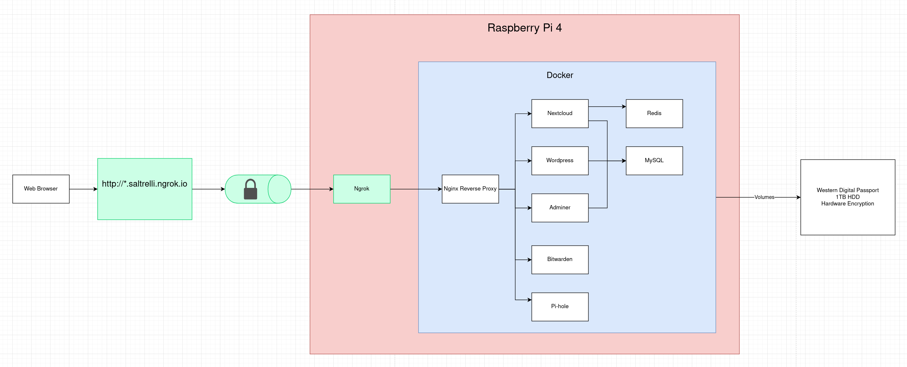

# Raspberry Pi



## .env File

```
POSTGRES_DB=...
POSTGRES_USER=...
POSTGRES_PASSWORD=...
MYSQL_ROOT_PASSWORD=...
MYSQL_USER=...
MYSQL_PASSWORD=...
MYSQL_DATABASE=...
PIHOLE_PASSWORD=...
DOMAIN_NAME=...
```

## Setup Steps

1. Install [Raspberry Pi Imager](https://www.raspberrypi.org/downloads/) on another computer
2. Insert microSD card
3. Flash Raspberry Pi OS to a microSD card using Raspberry Pi Imager
4. Remove microSD card and insert it into Raspberry Pi
5. Connect keyboard, mouse, and monitor to Raspberry Pi
6. Turn on Raspberry Pi
7. Follow on-screen setup instructions
8. [Give Raspberry Pi a static IP address](https://pimylifeup.com/raspberry-pi-static-ip-address/) (192.168.1.200)
9. Clone this repo on Raspberry Pi

```
git clone https://github.com/yarsiemanym/raspberry-pi.git
```

9. [Install Docker and Docker Compose on Raspberry Pi](https://www.zuidwijk.com/blog/installing-docker-and-docker-compose-on-a-raspberry-pi-4/)
10. Clone [evox95/wdpassport-utils](https://github.com/evox95/wdpassport-utils)

```
git clone https://github.com/evox95/wdpassport-utils.git
```

11. Install `wdpassport-utils` prereqs

```
sudo apt install python3 python3-dev python3-pip python3-pyudev
```

12. Connect WD Passport
13. Unlock WD Passport using `wdpassport-utils`

```
sudo ./wdpassport-utils.py -d /dev/sda -u
```
14.  Enter disk password
15.  Mount WD Passport

```
sudo mkdir /mnt/wd-passport
sudo mount /dev/sdb1 /mnt/wd-passport -o uid=pi,gid=pi
```

16. Start Pi-hole first

```
docker-compose up -d pihole
```

17. [Make Raspberry Pi its own DNS server](https://pimylifeup.com/raspberry-pi-dns-settings/)
18. Start web apps next

```
docker-compose up -d redis-commander
docker-compose up -d adminer
docker-compose up -d nextcloud
docker-compose up -d bitwarden 
docker-compose up -d blog
```

19.  Start Nginx reverse proxy last

```
docker-compose up -d reverse-proxy
```

## Virtual Hosts

nextcloud.home.lan => Nextcloud
bitwarden.home.lan => Bitwarden
blog.home.lan => Wordpress
pihole.home.lan => Pi-hole

## Links

- [Raspberry Pi 4](https://www.raspberrypi.org/products/raspberry-pi-4-model-b/)
- [Raspberry Pi OS](https://www.raspberrypi.org/downloads/)
- [How to Setup a Raspberry Pi Static IP Address](https://pimylifeup.com/raspberry-pi-static-ip-address/)
- [Raspberry Pi DNS Settings: How to Change the DNS](https://pimylifeup.com/raspberry-pi-dns-settings/)
- [Installing docker and docker-compose on a Raspberry Pi 4](https://www.zuidwijk.com/blog/installing-docker-and-docker-compose-on-a-raspberry-pi-4/)
- [Docker Compose](https://docs.docker.com/compose/)
- [Docker Hub](https://hub.docker.com)
  - [Postgres Container Image](https://hub.docker.com/_/postgres)
  - [MySQL Container Image](https://hub.docker.com/r/beercan1989/arm-mysql) (ARM compatible image)
  - [Adminer Container Image](https://hub.docker.com/_/adminer)
  - [Redis Container Image](https://hub.docker.com/_/redis)
  - [Nextcloud Container Image](https://hub.docker.com/_/nextcloud)
  - [Bitwarden Container Image](https://hub.docker.com/r/bitwardenrs/server) (ARM compatible image)
  - [Wordpress Container Image](https://hub.docker.com/_/wordpress/)
  - [Pi-hole Container Image](https://hub.docker.com/r/pihole/pihole)
  - [Nginx Container Image](https://hub.docker.com/_/nginx)
- [evox95/wdpassport-utils](https://github.com/evox95/wdpassport-utils)